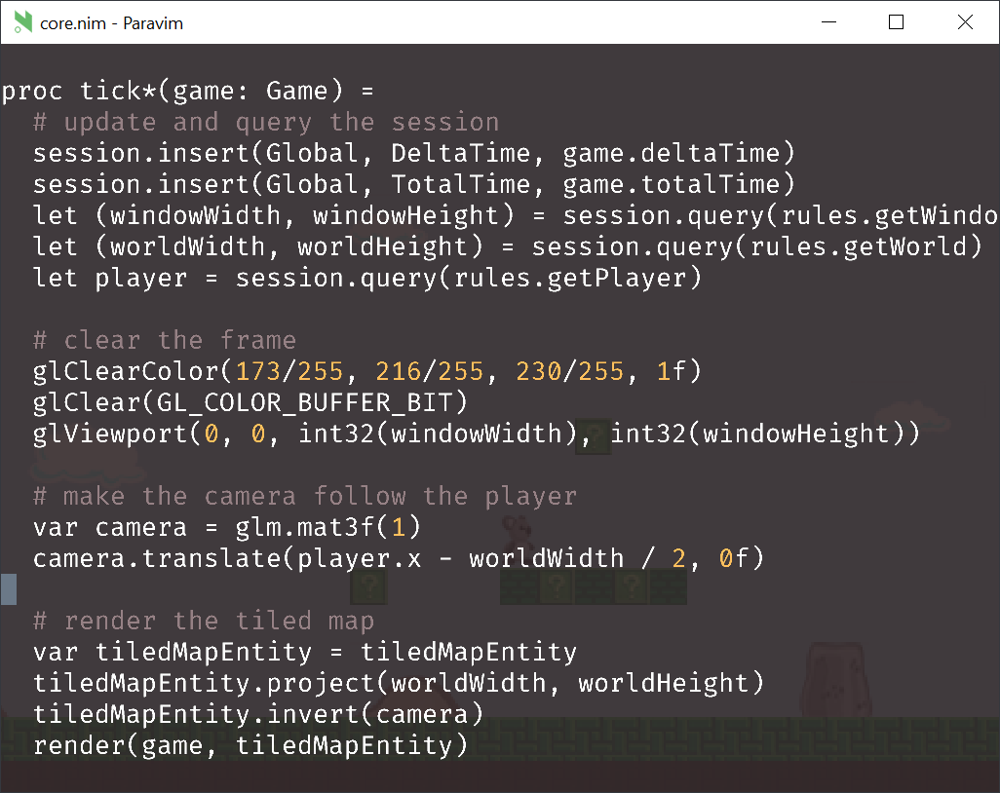

  

Paravim is an editor for Nim powered by Vim (via [libvim](https://github.com/paranim/libvim)) and rendered with OpenGL (via [paranim](https://github.com/paranim/paranim)). There are two ways to run it:

1. **As a standalone executable.** See the [pvim](https://github.com/paranim/pvim) repo for instructions on how to build it.

2. **Embedded inside a game.** You can try it by running the [parakeet](https://github.com/paranim/parakeet) example or any of the other [paranim examples](https://github.com/paranim/paranim_examples) via `nimble dev`, and then hitting `Esc` when the window appears.
